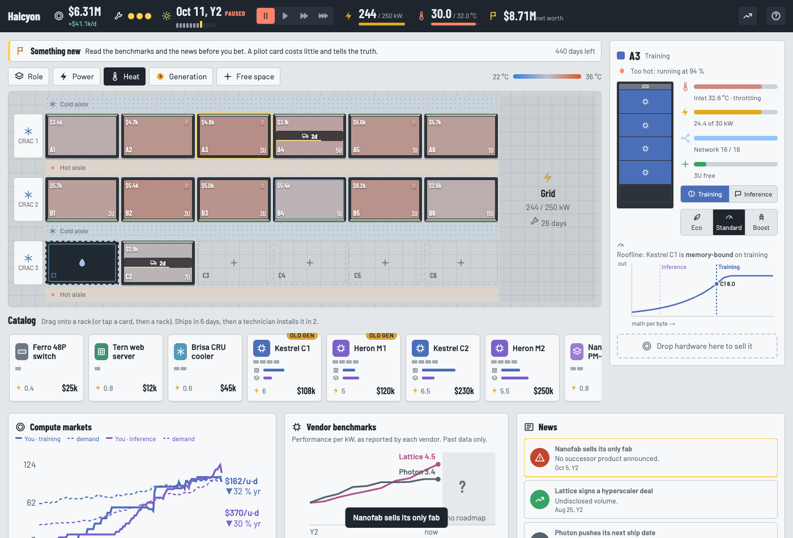

# Halcyon Compute



A real-time (pausable) datacenter tycoon prototype for Game Design Week 3: *strategic depth*.
Drag GPUs onto racks, match cards to workloads, survive summer, time your upgrades, and work out
which "disruptive" startup is real before you bet on it.

**Design write-up (characteristics, heuristics, depth evidence): [DESIGN.md](./DESIGN.md)**

## Play
Open `index.html` in a browser. It is plain HTML/CSS/JS and also works from `file://`. Or serve it:
```bash
python3 -m http.server 8765   # then http://localhost:8765/
```
- Space pauses; 1/2/3 set the speed; M cycles map modes; Esc cancels a tapped card.
- Drag a catalog card onto a rack to buy it. Drag hardware in the rack panel to another rack to move
  it, or onto the bin to sell it. On touch screens, tap a card and then a rack.
- `?seed=123` replays a specific game; `?debug=1` logs sim and UI events to the console.

## Develop
```bash
node --test test/*.test.js           # 24 tests: sim rules, determinism, bots
node bots/run.js --seeds 12 --ablate # depth report -> reports/depth.json
```

| File | Role |
|---|---|
| `js/sim.js` | Deterministic simulation core (seeded, 0.25-day substeps, no DOM). Loads in the browser and in Node |
| `js/ui.js` | Rendering, drag and drop, dialogs. Contains no game rules |
| `bots/bots.js` | Greedy and planner reference players, used for depth measurement and the end-screen comparison |
| `bots/run.js` | Ablation runner |
| `css/style.css` | Visual style, adapted from the reference artifact |
